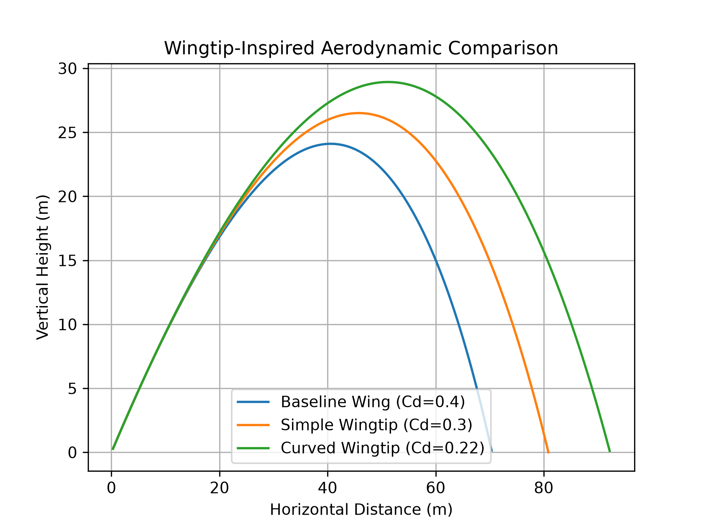
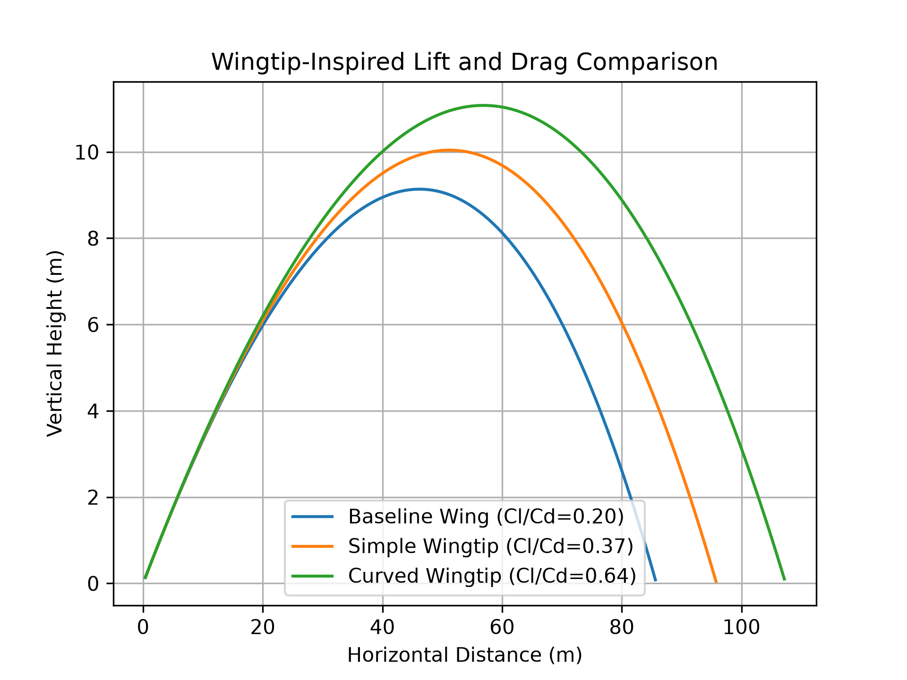
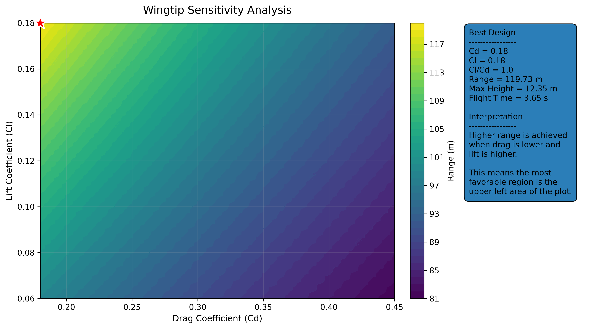

# AeroFlex Computational Lab

AeroFlex Computational Lab is a computational aerospace project built in Python to study how drag and lift affect the flight performance of a simplified wingtip-inspired model.

The project started with a basic projectile motion simulation, then added air resistance, then compared simplified wingtip configurations, and finally expanded into a sensitivity analysis testing 10,000 combinations of drag coefficient (Cd) and lift coefficient (Cl).

This is not a full CFD simulation or a final aerodynamic model. It is a simplified 2D computational study designed to explore trends, compare design assumptions, and build a foundation for future experimental validation.

## Research Question

How do changes in drag coefficient and lift coefficient affect the range, height, and flight time of a simplified aerospace-inspired model?

## Project Development

The project was built in four stages:

1. Basic projectile motion without air resistance.
2. Projectile motion with drag.
3. Wingtip-inspired comparison using drag coefficient only.
4. Lift-and-drag model followed by a high-resolution sensitivity analysis.

Each stage adds more realism and more analysis than the previous one.

## Physics Model

The model uses a simplified 2D motion simulation with gravity, drag, and lift.

The drag force is calculated as:

Fd = 0.5 * rho * Cd * A * v^2

Where:

- Fd is drag force
- rho is air density
- Cd is drag coefficient
- A is frontal area
- v is velocity magnitude

In the lift-and-drag version, the model also includes a simplified lift coefficient, Cl. The Cl/Cd ratio is used as a basic indicator of aerodynamic efficiency.

The model updates velocity and position step by step using numerical integration.

## Files

- trajectory_simulator.py: basic projectile motion without air resistance
- trajectory_with_drag.py: projectile motion with air resistance
- design_comparison.py: comparison of generic low, medium, and high drag designs
- aerodynamic_results.csv: numerical results from the generic drag comparison
- aerodynamic_design_comparison.png: graph from the generic drag comparison
- wingtip_comparison.py: drag-only comparison of wingtip-inspired configurations
- wingtip_results.csv: results from the drag-only wingtip comparison
- wingtip_design_comparison.png: graph from the drag-only wingtip comparison
- wingtip_lift_drag_model.py: comparison using both lift and drag coefficients
- wingtip_lift_drag_results.csv: results from the lift-and-drag model
- wingtip_lift_drag_comparison.png: graph from the lift-and-drag model
- wingtip_sensitivity_analysis.py: high-resolution sensitivity analysis testing 10,000 Cd and Cl combinations
- wingtip_sensitivity_results.csv: results from the sensitivity analysis
- wingtip_sensitivity_analysis.png: graph from the sensitivity analysis
- EXPERIMENT_PLAN.md: plan for future physical validation using prototype tests
- experimental_data_template.csv: template for recording physical prototype test results

## Wingtip Configurations

The simplified wingtip comparison uses three conceptual configurations.

### Baseline Wing

The Baseline Wing is the reference design. It has the highest drag coefficient in the wingtip comparison.

### Simple Wingtip

The Simple Wingtip represents a moderate improvement over the baseline design. It has lower drag and slightly higher lift.

### Curved Wingtip

The Curved Wingtip represents the most efficient of the three fixed configurations. It has the lowest drag coefficient and the highest lift-to-drag ratio in the simplified model.

## Results: Drag-Only Wingtip Model

The first wingtip comparison used only drag coefficient, Cd.

| Configuration | Cd | Range (m) | Max Height (m) | Flight Time (s) | Range Improvement |
|---|---:|---:|---:|---:|---:|
| Baseline Wing | 0.40 | 70.35 | 24.10 | 4.39 | 0.00% |
| Simple Wingtip | 0.30 | 80.86 | 26.50 | 4.62 | 14.95% |
| Curved Wingtip | 0.22 | 92.20 | 28.93 | 4.83 | 31.06% |

In this version, reducing drag increased the range, maximum height, and flight time of the model.

## Results: Lift and Drag Model

The second model added lift coefficient, Cl, in addition to drag coefficient, Cd.

| Configuration | Cd | Cl | Cl/Cd | Range (m) | Max Height (m) | Flight Time (s) | Range Improvement |
|---|---:|---:|---:|---:|---:|---:|---:|
| Baseline Wing | 0.40 | 0.08 | 0.20 | 85.61 | 9.14 | 2.85 | 0.00% |
| Simple Wingtip | 0.30 | 0.11 | 0.37 | 95.74 | 10.04 | 3.07 | 11.83% |
| Curved Wingtip | 0.22 | 0.14 | 0.64 | 107.16 | 11.08 | 3.32 | 25.17% |

In this version, the Curved Wingtip also performed best because it combined lower drag with a higher lift-to-drag ratio.

## Sensitivity Analysis

After comparing only three fixed configurations, I expanded the project with a high-resolution sensitivity analysis.

Instead of testing only three designs, this version tested 10,000 combinations of drag coefficient and lift coefficient. The goal was to identify which combination produced the greatest flight range under the same initial conditions.

The best result found was:

| Cd | Cl | Cl/Cd | Range (m) | Max Height (m) | Flight Time (s) |
|---:|---:|---:|---:|---:|---:|
| 0.18 | 0.18 | 1.00 | 119.73 | 12.35 | 3.65 |

The sensitivity analysis showed that the best performance occurred in the upper-left region of the plot, where drag is low and lift is high. This supports the idea that improving the lift-to-drag relationship can increase flight range in the simplified model.

## Experimental Validation Plan

The next step is to connect the simulation to a physical experiment.

The experimental validation plan is documented in [EXPERIMENT_PLAN.md](EXPERIMENT_PLAN.md).

The prototype design plan is documented in [PROTOTYPE_DESIGNS.md](PROTOTYPE_DESIGNS.md).

The experimental data template is included in [experimental_data_template.csv](experimental_data_template.csv).

The goal of the physical test will be to build and compare three simplified prototypes:

- Baseline Wing
- Simple Wingtip
- Curved Wingtip

The physical experiment would measure:

- flight distance
- flight time
- stability
- visible flight behavior

The purpose is not to prove that the simulation is perfectly accurate. The goal is to check whether the same general trend appears in both the computational model and the physical test.

## What I Found

The results showed a consistent pattern across the project.

Lower drag improved flight performance. When lift was added, configurations with a better lift-to-drag ratio performed better. In the sensitivity analysis, the best design appeared where Cd was lowest and Cl was highest within the tested range.

This suggests that aerodynamic efficiency has a strong effect on range, height, and flight time in the simplified model.

## Limitations

This project is simplified and does not represent a complete aerodynamic simulation.

The model does not include:

- real wing geometry
- lift distribution
- wingtip vortices
- turbulence
- pressure distribution
- full 3D airflow
- CFD analysis
- wind tunnel validation

The Cd and Cl values are conceptual. They are used to compare trends, not to represent measured aerodynamic coefficients from a physical wing or CFD software.

Because of this, the results should be interpreted as a computational exploration, not as a final engineering conclusion.

## How to Run

Install the required libraries:

py -m pip install numpy matplotlib

Run the drag-only wingtip comparison:

py wingtip_comparison.py

Run the lift-and-drag model:

py wingtip_lift_drag_model.py

Run the sensitivity analysis:

py wingtip_sensitivity_analysis.py

The programs generate CSV files and PNG graphs with the simulation results.

## Next Steps

The next step is to connect the simulation to a physical experiment.

A stronger version of this project could include:

- building three physical prototypes
- testing a baseline wing, simple wingtip, and curved wingtip
- measuring distance, flight time, and stability
- comparing experimental results with the simulation
- refining Cd and Cl assumptions using real data

This would turn the project from a computational model into a simulation-and-validation study.

## Conclusion

AeroFlex Computational Lab shows how Python, physics, and data visualization can be used to explore aerospace design ideas.

The project began with basic projectile motion and developed into a larger analysis of drag, lift, and aerodynamic efficiency. The sensitivity analysis tested 10,000 parameter combinations and showed that the best performance occurred with low drag and high lift.

Although the model is simplified, it provides a clear foundation for future experimental validation and more advanced aerospace analysis.